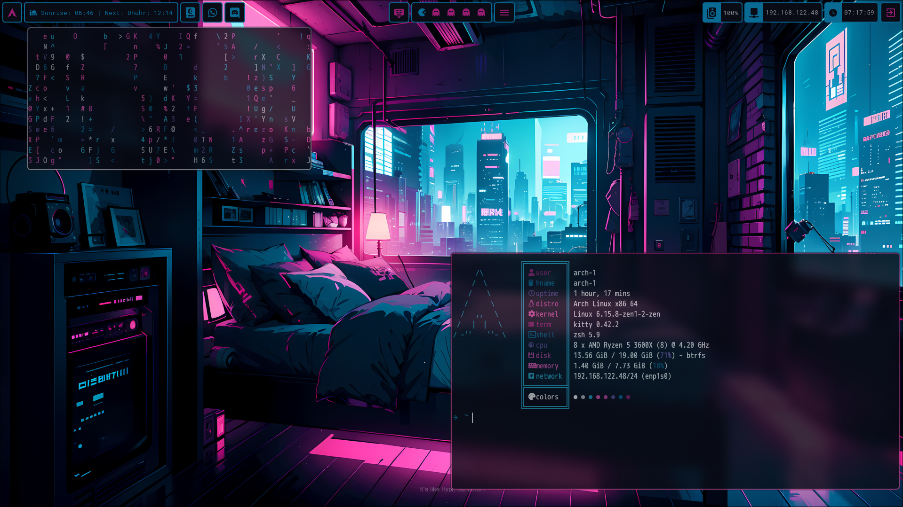
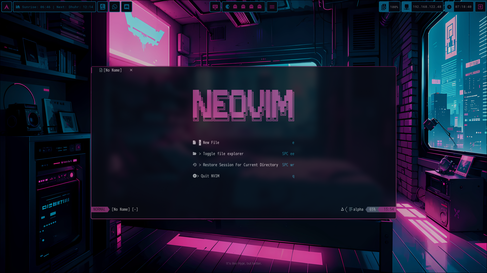
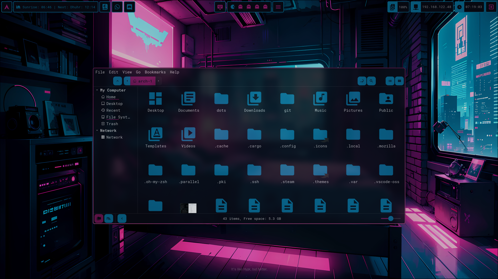
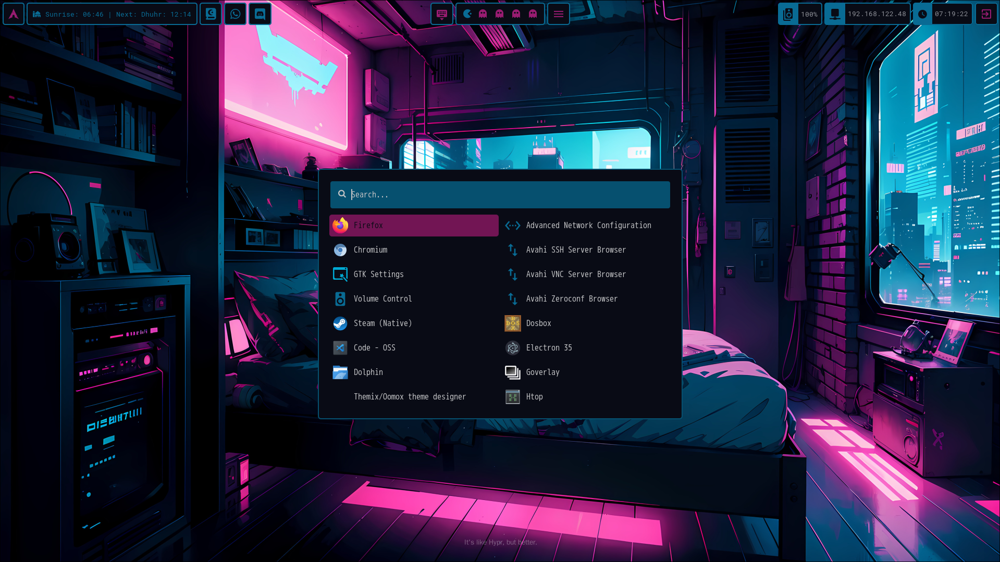

Installation:

1. Clone the repo: 
```bash
git clone https://github.com/Riezz0/neon-anime.git
```
2. Change executeable permissions
```
chmod +x /home/$USER/dots/setup.sh
```

3. Run the setup - Ensure you are in the /home/$USER/dots directory
```bash
cd /home/$USER/dots/ 
```
```bash
./setup.sh
```

4. Ensure you type "exit" once oh-my-zsh has installed so that the remainder of the installation may continue

5. Enjoy !!!!

This is still a W.I.P XD

Important Notes:

1. This setup might not be compatible with your setup. 
2. This has been setup using a fresh install of ARCH and Hypland with the Linux-Zen Kernel and lightdm-gtk-greeter.
3. Install pywalfox for theming the firefox browser.
4. Hardware Used - AMD CPU And GPU.

